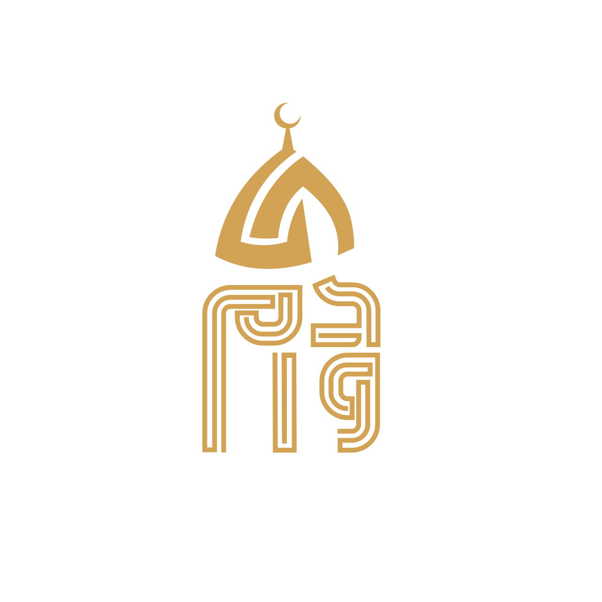

<!-- ABOUT THE PROJECT -->
## About The Project
This project is part of the Graduation project at the Faculty of Engineering Systems and Computers Department at Al-Azhar University
with the title: DAWAM Platform for Everlasting documents security using blockchain technology taking Waqf as an example.
The project consists of a web and mobile application.

 exploring the stored documents and applying documents to be stored, and a web dashboard to enter documents and approve the applied documents.
The platform turn document into NFT and store them on the blockchain (Ethereum as an example) to make sure they are immutable, secure, and everlasting.

<a href="https://github.com/JannaIbrahim/DawamGP">Explore more about DAWAM</a>

<!-- PROJECT LOGO -->
 

  

### DAWAM mobile application
The mobile app allows users to explore all documents stored on the platform and search through them with an advanced search facility also they could request adding their documents.
The Mobile app was developed using Kotlin for Android OS.

